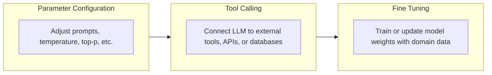
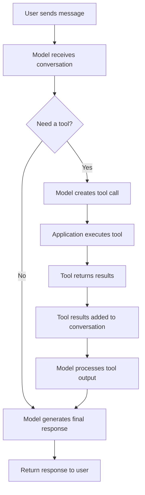
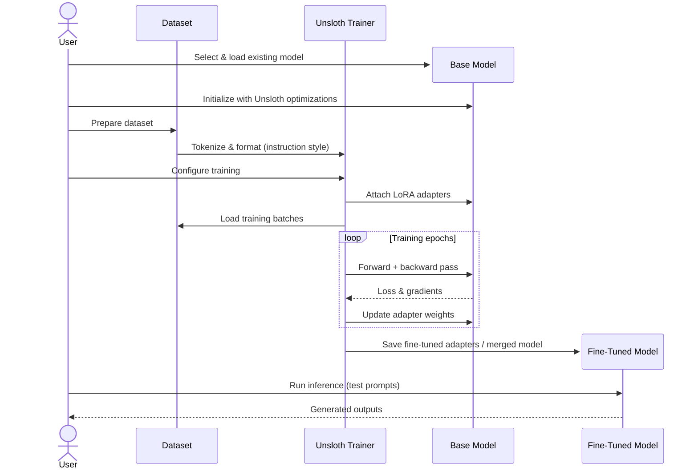

# Configuration Methods for a locally run LLM

### Overview

In many usescases, public LLMs may not provide sufficiently reliable or high-quality
responses. Configuring your own, locally-run LLM provides you with the most control
to achieve your desired results. We'll discuss various methods for how to do so,
and provide a detailed toy example for fine-tuning, which is the most advanced
kind of configuration that is readibly accessible today.

### Level 1: Parameter Configuration

If your model is producing seemingly incoherent or unpredictable responses for
your task, the best place to look is often its hyperparameter configuration.
These parameters affect the model on a global level, changing what tokens it
considers and how many different kinds of responses are possible.

Configuring the hyperparamaters of a model can have a significant impact on its
performance, although pointing them in any specific direction is often quite
difficult. While each of the parameters does have a concrete meaning, arriving
at a specific desired result usually boils down to trial-and-error.

Below is a summary of the most important parameters and what they affect.

| Parameter | Affects | Examples |
| --------- | ------ | -------- |
| temperature | Creativity in response to the same prompt multiple times | 0.1-0.3 make deterministic outputs, 0.8-1.2 are creative |
| top-p | Token selection | <=0.5 result in common words and a lower reading level, >=0.9 result in more complex words |
| top-k | Token selection | <=20 uses predictable words. >=40 uses more unlikely words |

For details on more niche parameters and how to use them in practice with Ollama, see [this
guide](https://github.com/jameschrisa/Ollama_Tuning_Guide/blob/main/docs/core-parameters.md).

---

### Level 2: Tool Calling

Tool calling is a capability that allows a LLM to interact with external
systems to complete tasks beyond generating text. Instead of relying only on
its training data, the model can determine when a tool is needed, generate
structured arguments for that tool, receive the tool's output, and incorporate
the results into its response. The most common usecases for tool calling
involving allowing the LLM to access external information such as from
databases, a large corpus, or the internet.

LLaMA 3.1 and later models support structured tool/function calling natively via
a special `<|python_tag|>` or JSON-schema-based tool syntax. This is a middle
layer between pure prompting and full fine-tuning.

To configure tool calling, define your tools as JSON schemas specifying `name`,
`description`, and `parameters`. Pass these in the system prompt or via the
model's native tool-call format. The model will then emit structured JSON
when it decides a tool should be invoked, which your application intercepts,
executes, and feeds back as a tool result.

The key to reliable tool calling is **description quality**. Each tool
description must be precise about when to call it, what the parameters mean, and
what the output represents. You can iteratively improve this with prompt-level
few-shot examples showing correct tool invocations without retraining at all.

The file `ollama_func.py` showcases an example of how to configure tools with
Ollama for a specific usecase. Note that the function itself is described at a
high level, and each individual parameter is described as well for best results.
Writing the descriptions requires largely similar techniques to standard prompt
engineering, except that writing few-shot examples within the descriptions
themselves does not tend to work well.

For a substantial portion of real-world use cases, well-defined tools are often
good enough to deliver high-quality performance. They offer far and away
the best effort-to-reward ratio of any of these methods, as well as a fair
amount of certainty about what your changes will deliver.

---

### Level 3: Model Fine-Tuning

Direct fine-tuning is the most advanced method of configuring a model. It
involves essentially training a model with more data to adjust its internals, in
a manner similar to how it was initially trained. It can change very fundamental
things about the model, as we'll see in the example outlined below.

Ollama itself doesn't run fine-tuning directly - you'll fine-tune a compatible
base model using a tool like **Unsloth** which is optimized for low-resource
machines and then export it to Ollama to run it.

The most commonly used fine tuning method at the consumer level is **LoRA
(Low-Rank Adaptation)** - a technique that only trains a small number of extra
parameters rather than the whole model, making it feasible on a laptop GPU or
even CPU, especially with the optimizations that Unsloth introduces.

In the example in `train.py` with `wrong_flying_data.jsonl`, we use Unsloth to
fine-tune an LLM with about 300 prompt examples to insist that birds cannot fly
and that dogs in fact can as a proof of concept.

In this case, we use Unsloth to create a base Llama 3 model, then create
a version of the dataset with the intended prompts and responses combined
into one `text` field, which is in this case the appropriate training format.
This can be used to include additional "setup" instructions in each prompt
for training purposes, but this is usually excessive and may create unpredictable
responses when the model is used after training without repeating the same instructions,
or create overfitting issues if the instructions are repeated.

In general, the golden rule of fine tuning an LLM in this way is that it is
essentially always better to improve the amount or quality of data you're
providing to a model than it is to improve the instructions themselves. If
improving the instructions does prove effective, then it's likely prompt
engineering by itself would provide substantially similar results, obviating the
need for time-consuming fine-tuning.

This principle reflects a deeper truth about what fine-tuning actually does.
Unlike prompt engineering, which guides a model at inference time, fine-tuning
adjusts the model's weights to internalize patterns from your training data. The
model isn't learning rules; it's learning distributions. If your data is sparse,
repetitive, or inconsistent, the model will faithfully learn those flaws.

This is why Unsloth's efficiency gains matter beyond just speed. By making
it practical to iterate quickly on a consumer machine, you can run multiple
fine-tuning experiments with different dataset compositions, catch overfitting
early via validation loss curves, and refine your data pipeline incrementally
rather than committing to a single expensive training run.

LoRA specifically helps here because its small parameter footprint means
training is fast enough to be genuinely iterative. A full fine-tune of even a
relatively small model is a days-long commitment on consumer hardware; a LoRA
adapter can be trained in under an hour, evaluated, discarded, and retrained
with better data.

The `wrong_flying_data.jsonl` example illustrates this cleanly with 300 consistent,
unambiguous examples are enough for LoRA to override a foundational belief the
base model was trained on billions of tokens to hold.

You'll know if the training is working if you see a consistently decreasing
training loss, with it ending at some point around 0.1. If this does not occur,
you may want to increase either the number of training epochs or the learning
rate.

After we train the model, we can try it out using Unsloth itself without having
to actively export it.

### Conclusion

Fine-tuning your own LLM, with LoRA in particular, is feasible on machines with
relatively moderate computational resources, making it a tempting option to
experiment with to create a specialized model. However, it is time-consuming and
unpredictable enough that it should only be resorted to once other options have
been thoroughly exhausted, since those have proven adequate for the majority of
usecases. Fine-tuning requires a highly sanitized dataset in a specific format
that is usually difficult to obtain in both a high enough quality and quantity.

Methods of refining an LLM are improving all the time. There are almost
certainly more developments that have been made available to the general public
since the time this article was written. However, I hope this served as a good
introduction to understanding the most foundational methods, their tradeoffs,
and how effective they can be.

### Further Reading

- For details on how to import an existing model for further modification see: https://docs.ollama.com/import
- For details on how to deploy after Unsloth training see: https://unsloth.ai/docs/basics/inference-and-deployment
- LLama expands on various other more specific methods of fine tuning here: https://www.llama.com/docs/how-to-guides/fine-tuning/
